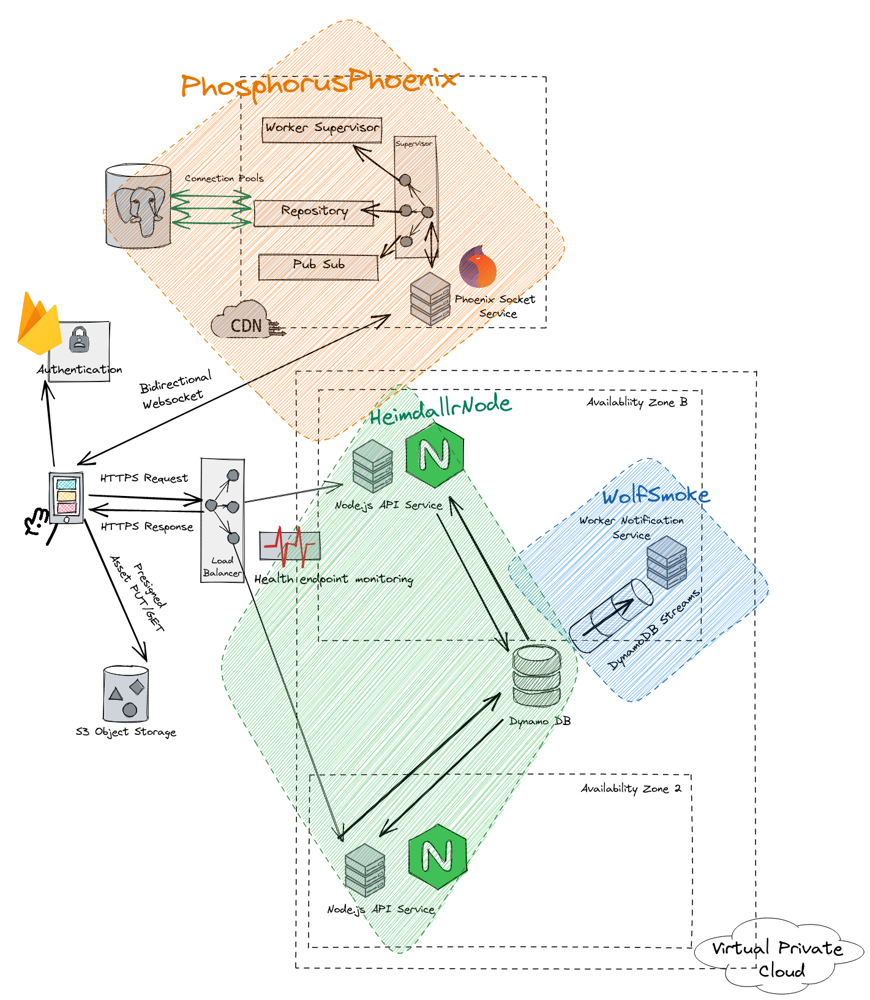

# OrbisTertius

> “Nothing is built on stone; All is built on sand, but we must build as if the sand were stone.”




## Initiation of  Phos Phoenix Service

Start Postgres Services Locally
PGAdmin @ localhost:5050
``` bash
docker-compose -f phos-compose.yml up 
```


To start the Phos Service:

    Enter the PhosphorousPhoenix directory
    Install dependencies with mix deps.get
    Create and migrate your database with mix ecto.setup
    Migrate using mix ecto.migrate to update the repository that maps to Postgres data store
    Start Phoenix endpoint with mix phx.server OR iex -S mix phx.server

Testing:

    mix test
